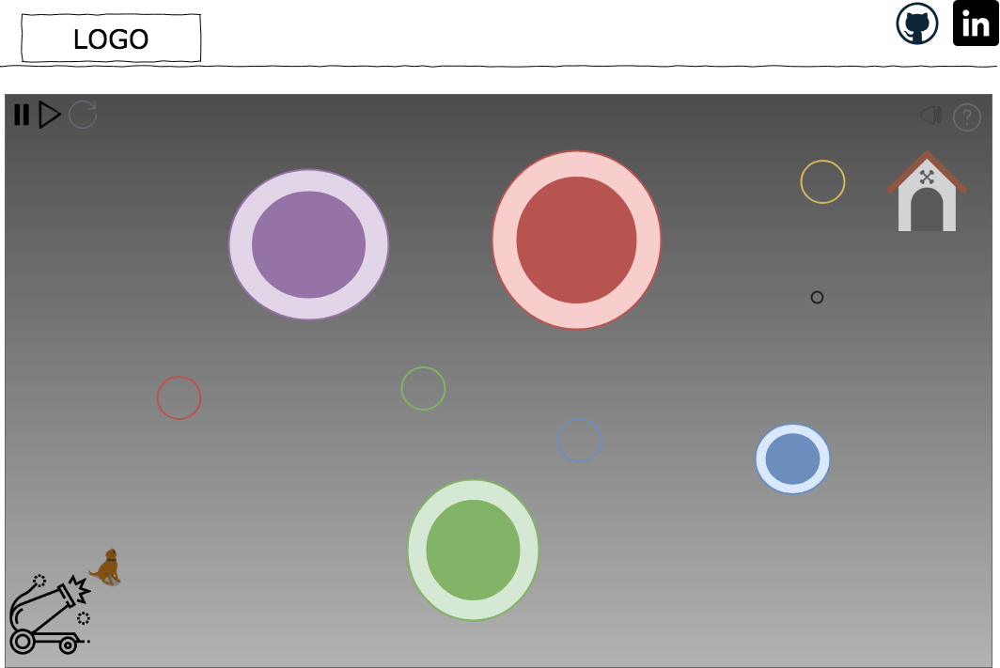

# Doge Launch

## Background and overview
Doge Launch is an interactive game that utilizes velocity, acceleration, gravity, and rotational forces in a reimagined golf experience.  

Users will be able to control the velocity(speed and direction) of the doge ball, which will be affected by the surrounding gravitational entities, and bumpers.  Every bumper and gravitation entity will emit sounds and change color as they affect the dogeball.  

## Functionality and MVPs
Doge Launch will have the following functionality
1. Users can control the velocity(direct and speed) of the doge.
2. The game will consist of several pre-made levels to challenge the user.
3. Hear sounds on collision and whenever gravitational forces are affecting the doge.
4. Start, pause, restart, and reset the simulation.
5. Inuitive UX designs to ensure the user is familar with how to play, as well as a help button for more information.  

## Wireframe
The application will consist of a single page with the game, displaying the lives, current level, mute button, restart/reset/pause buttons, and links to my Github and LinkedIn pages.  




## Architecture and Technologies
This project will be implemented with the following technologies:

1. Vanilla JavaScript for overall structure and game logic,
2. HTML5 Canvas for DOM manipulation and rendering,
3. Web Audio API for sound generation, processing and control. WebAudioAPI allows for simultaneous sounds with more dependable time triggering
4. Webpack to bundle and serve up the various scripts.
5. Utlize attractors and entities gravity to simulate gravity free space. 

In this application there will be 4 scripts: 

``board.js``: This file handles the logic for animating and updating the DOM elements.

```blackhole.js```: this script will house the logic for the 'black holes' that affect the doge ball as well as the audio.

```dogeball.js```: this script will house the movement and sounds for the doge ball.

```bumper.js```: this script will house the logic for the bumpers in the game, as well as the accompanying audio.

## Timeline

**Over the weekend**
- [ ] Research gravity and attraction and possible libraries I may need to use.
- [ ] Setup the backbone and required mathmatical function (distance, gravity, velocity)
- [ ] Setup webpack, dist folder, canvas.

**Day 1**: Ensure webpack is setup correctly, that the page is displaying, and start coding logic for the game.  Goals:
- [ ] Create methods that will allow users to control the velocity of the dogeball.
- [ ] start exploring attraction and gravity and their affects on the dogeball.

**Day 2** Spend this day focusing on getting the gravitation pull(attraction) and rotational forces down so that the dogeball can rotate and be affected by the black holes correctly. Build out the blackhole.js file and connect it to our board.js
- [ ] Complete dogeball.js
- [ ] Start testing and coding blackhole.js.

**Day 3**: Spend this day working on the bumpers and 'home/goal' logic.  
- [ ] Code out the win condition for the game in board.js.
- [ ] Start working on bumper.js(constructor, update functions, colors, sounds)
- [ ] Get colors and sound for bumpers and black holes. 

**Day 4** Style the frontend, add background, add levels.
- [ ] Style the canvas, add background and links
- [ ] make sure the play, restart, pause buttons are working.
- [ ] Add additional levels to the game.

